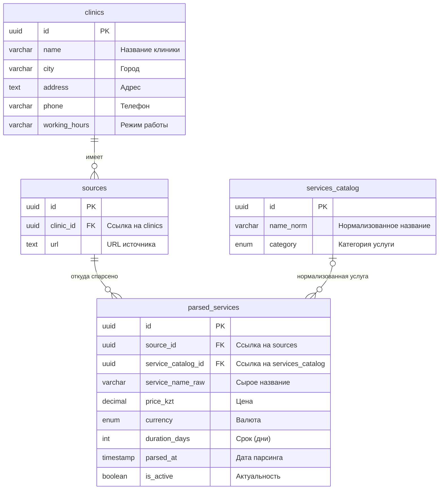

# Архитектура базы данных

В данном документе описывается структура базы данных (PostgreSQL), предназначенная для хранения информации о клиниках, источниках парсинга, справочнике услуг и сырых/распарсенных данных об услугах.

## Общая структура и связи

Архитектура состоит из 4 основных таблиц:

1. **`clinics`** — хранит базовую информацию о медицинском учреждении.
2. **`sources`** — хранит ссылки на сайты (или другие источники), откуда берутся данные для конкретной клиники.
3. **`services_catalog`** — нормализованный справочник медицинских услуг (единый стандарт наименований).
4. **`parsed_services`** — таблица, куда сохраняются результаты парсинга (цены, сырые названия услуг) с привязкой к источнику и, по возможности, к нормализованному справочнику.

## Описание таблиц

### 1. `clinics` (Клиники)
Хранит мастер-данные о клинике.
- `id`: Уникальный UUID клиники.
- `name`: Название (например, "МедСити").
- `city`, `address`: Локация клиники.
- `phone`, `working_hours`: Контактные данные.

### 2. `sources` (Источники)
Хранит URL-адреса, с которых собираются данные для клиники.
- Одной клинике может принадлежать несколько источников (например, разные разделы сайта или сайты партнеров). При удалении клиники связанные источники удаляются каскадно (`ON DELETE CASCADE`).

### 3. `services_catalog` (Справочник услуг)
Используется для приведения различных наименований одной и той же услуги из разных клиник к единому стандарту.
- `name_norm`: Нормализованное название.
- `category`: Тип услуги. Используется ENUM `service_category` (`лаборатория`, `прием врача`, `диагностика`, `процедура`).

### 4. `parsed_services` (Спарсенные услуги)
Это основная таблица сбора данных парсера. Сюда складываются "сырые" цены и названия.
- `source_id`: Показывает, с какого URL (источника) пришла эта запись.
- `service_catalog_id`: Связь со справочником. Может быть `NULL`, если спарсенная услуга ещё не сопоставлена ни с одной нормализованной услугой из справочника.
- `service_name_raw`: Как услуга называлась на сайте клиники.
- `price_kzt`: Стоимость услуги.
- `currency`: Валюта по ENUM `currency_enum` (`KZT`, `USD`). Предполагается, что в приложении или скриптах парсинга сумма конвертируется в KZT при необходимости.
- `duration_days`: Актуально для анализов (срок готовности в днях).
- `parsed_at`: Точное время последнего парсинга.
- `is_active`: Флаг актуальности (можно сбрасывать в `false`, если при новом парсинге услуга пропала с сайта).
